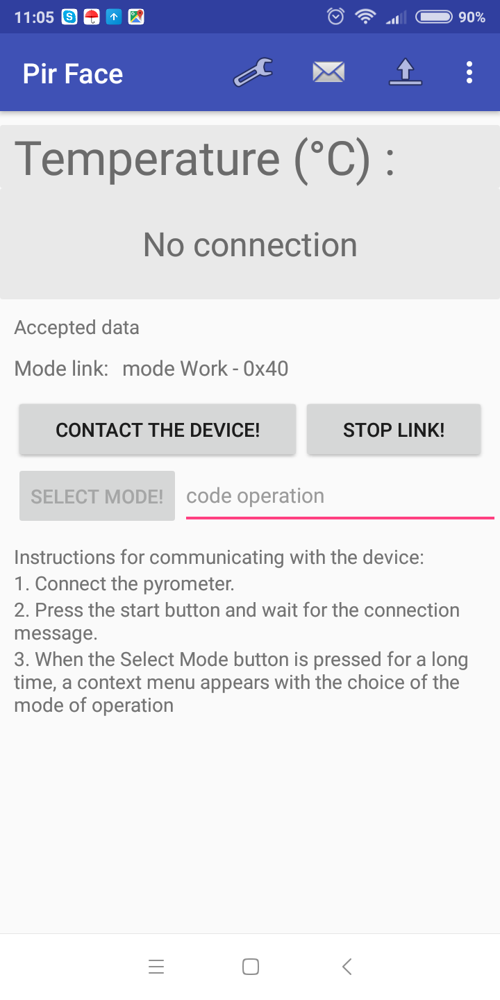
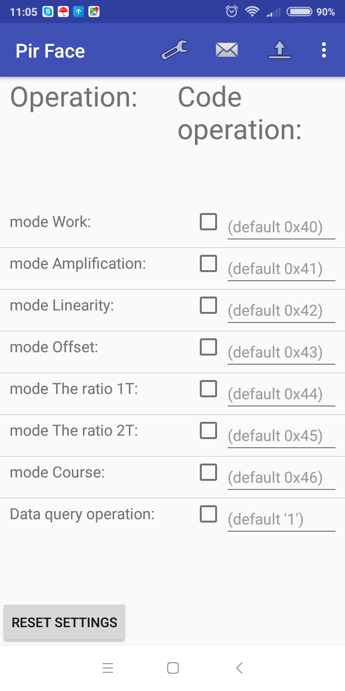
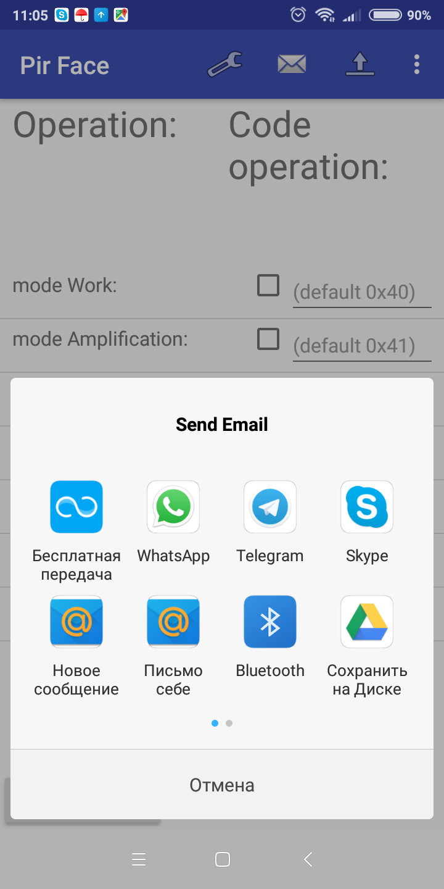

# Android

Hello. I am junior java developer.
---
This repo for project of application for send and recive some data from pirometr (FTDI protocol).
The application is ready for use and easy to perform
---
If you can suggest me improvements, welcom to try.

***
Main screen

***
Settings screen

***
"Send msg to technical support" screen

***